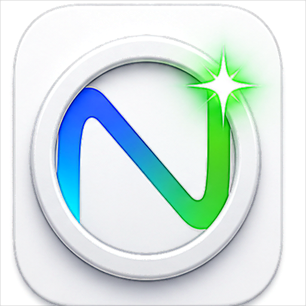
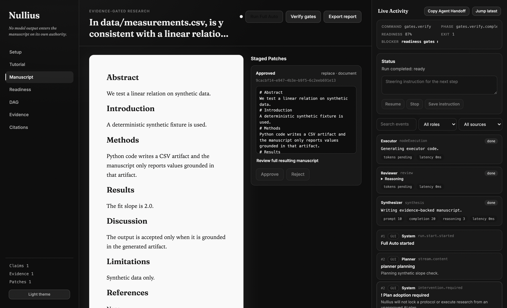

<p align="center">
  
</p>

<h1 align="center">Nullius</h1>

<p align="center">
  <strong>Evidence-gated AI research on your own machine.</strong>
</p>

<p align="center">
  <em>Nullius in verba</em> — take nobody's word for it.
</p>

<p align="center">
  <a href="docs/paper/nullius.pdf"></a>
  <a href="https://github.com/Mikopoto/nullius/actions/workflows/ci.yml"></a>
  
  
  
</p>

<p align="center">
  <sub><strong>Definition.</strong> Nullius is a local-first research harness where AI agents may plan, code, and draft, but manuscript claims are admitted only after deterministic evidence gates can trace them to executed artifacts, verified citations, and reproducible project state.</sub>
</p>

---

Nullius lets AI models plan research, write and execute analysis code, and draft a manuscript, while deterministic gates make sure that **no number and no citation enters the report unless it can be traced to real evidence**. The name is from the Royal Society's motto, *nullius in verba*: take nobody's word for it.

<p align="center">
  
</p>
<p align="center">
  <sub>The manuscript is the only light: what you read has passed the gates. <a href="docs/screenshots/light-setup.png">Light theme</a> is one toggle away.</sub>
</p>

- Every quantitative claim must match a value in an artifact produced by locally executed, sandboxed code (value matching, not substring matching).
- Every citation must resolve on Crossref and survive title/author/year/retraction checks.
- Manuscript patches with any blocking warning are rejected **before** they are written, even in fully autonomous runs.
- Three model roles (planner / executor / reviewer), independently configurable, watch each other; a live console streams every token and reasoning trace.

Does it matter? In the bundled case study, the same `gpt-4o-mini` asked directly about a 40-point dataset reported a regression slope of **1.9450** (truth: 3.0, a 35% error) with a confident R². Through Nullius, the same model produced a sandbox-executed slope of **3.0007**, and its one attempt to embellish the manuscript with statistics it never computed was blocked at the write boundary. The paper also includes two measured **Codex vs Codex + Nullius CLI** comparisons using `codex-cli 0.141.0`, `gpt-5.5`, and `model_reasoning_effort=xhigh`: Codex computed the analyses correctly, but direct reports failed Nullius audit because they were not saved as evidence-backed research objects. See the paper: [`docs/paper/nullius.pdf`](docs/paper/nullius.pdf) and raw logs in [`docs/paper/evaluation/`](docs/paper/evaluation/).

## Install

### Option A: macOS app (Apple Silicon)

Download `Nullius.dmg` from [Releases](../../releases), open it, and drag Nullius to Applications. The app is not notarized yet; on first launch, right-click the app → Open (or run `xattr -dr com.apple.quarantine /Applications/Nullius.app`).

The desktop app needs [Node.js 20+](https://nodejs.org) installed (it runs the local research server with it).

### Option B: from source (Windows / Linux / macOS)

Requirements: Node.js 20+, pnpm, and for the desktop app Rust + the [Tauri v2 prerequisites](https://v2.tauri.app/start/prerequisites/).

```bash
git clone https://github.com/Mikopoto/nullius.git
cd nullius
pnpm install
pnpm build              # builds core, CLI, server, and the web UI
pnpm test               # 90 tests should pass

# CLI is ready now:
node packages/cli/dist/index.js --help

# Desktop app (dev):
pnpm --filter @nullius/desktop tauri:dev
# Desktop app (macOS build + launch):
./script/build_and_run.sh
```

## Quick start (GUI)

**Fastest first look: press "Try the 60-second demo" on the Setup screen.** It seeds a sample project with a bundled CSV and runs the whole pipeline with free deterministic demo agents: you read the drafted plan, adopt it, and watch the gates admit only evidence-backed text. No API key, nothing billed.

For real research, the app ships a built-in **Tutorial tab (English / 日本語)** with the full flow. In short:

1. **API key** — Setup → API Keys. Easiest: an [OpenRouter](https://openrouter.ai) key (one key, many models). macOS stores it in the system Keychain; Windows/Linux keep it in memory for the session (use an environment variable to persist). Keys are never written to project files.
2. **Project** — Setup → Project: Browse… to pick an empty folder and write your research question.
3. **Data (optional)** — press "Add data files…". Files land in the project's `data/` folder; **every Full Auto run automatically copies them into the analysis working directory and instructs the AI to base the research on them.** No files = the AI generates the data its plan requires.
4. **Models (optional)** — per-role provider + model id (default `openrouter/auto`).
5. **Plan** — Generate Plan, read it, **Adopt** (this locks the success criteria; the run will not proceed without it).
6. **Run Full Auto** — watch the live console; if it pauses, read the intervention card, optionally type a steering instruction, Resume.
7. **Review & export** — approve/reject staged patches in Manuscript, check the Readiness lights, Export. The result is `<project>/manuscript/report.md`.

## Quick start (CLI)

**Try it free (no API key).** Deterministic local mock agents, no model calls:

```bash
nullius() { node packages/cli/dist/index.js "$@"; }   # build first: pnpm --filter @nullius/cli build

nullius init demo --question "Is y linear in x?"
nullius run demo --mock                           # drafts a plan, pauses
nullius list plans demo                           # copy the plan id
nullius adopt <planId> demo
nullius run demo --mock                           # full mock pass
nullius verify demo --json                        # gate report; exit 0 when every number traces
```

Then, with a real provider:

```bash
nullius() { node packages/cli/dist/index.js "$@"; }

nullius keys set openrouter sk-or-v1-...          # macOS Keychain
# Windows/Linux, or CI:
export OPENROUTER_API_KEY=sk-or-v1-...

nullius init myproject \
  --question "Is y linear in x in data/measurements.csv?" \
  --provider openrouter \
  --model openrouter/auto
cp measurements.csv myproject/data/               # optional: your input data
nullius run myproject                             # pass 1: drafts a plan, pauses
nullius adopt <planId> myproject                  # human approval locks the protocol
nullius run myproject                             # full pass: generate, execute, review, gate
nullius verify myproject --json                   # exit 0 only if every gate is green
nullius export md myproject                       # final report
```

### CLI AI provider and model setup

Nullius has three AI roles: `planner`, `executor`, and `reviewer`. By default all three use:

```text
provider: openrouter
model:    openrouter/auto
```

Supported API providers in the current CLI are:

```text
openrouter | openai | anthropic | customOpenAICompatible
```

API keys can be supplied either through the macOS Keychain or environment variables:

```bash
nullius keys set openrouter sk-or-v1-...   # macOS only
nullius keys env                           # prints the expected env var names

export OPENROUTER_API_KEY=sk-or-v1-...
export OPENAI_API_KEY=sk-...
export ANTHROPIC_API_KEY=sk-ant-...
export CUSTOM_OPENAI_API_KEY=...
export CUSTOM_OPENAI_BASE_URL=https://your-openai-compatible-endpoint/v1
```

Set one model for all roles at project creation:

```bash
nullius init myproject \
  --question "..." \
  --provider openrouter \
  --model anthropic/claude-sonnet-4.5
```

Or split roles explicitly:

```bash
nullius init myproject \
  --question "..." \
  --planner-provider openrouter --planner-model openai/gpt-4o-mini \
  --executor-provider openrouter --executor-model google/gemini-2.5-flash \
  --reviewer-provider openrouter --reviewer-model anthropic/claude-sonnet-4.5
```

Change models later:

```bash
nullius models myproject
nullius models myproject --executor-model openai/gpt-4o-mini
nullius models myproject --provider openrouter --model openrouter/auto
```

The settings are written to `<project>/nullius.json`; API keys are not written to project files.

`nullius verify --json [--gate numbers|citations|repro|all]` is a stable contract for **research CI**: wire it into your pipeline so no ungrounded number can merge, the same way tests gate code. Every field, the `schemaVersion` policy, and a full example are frozen in [`docs/verify-contract.md`](docs/verify-contract.md).

## For AI agents

If you are an AI agent driving this repository, read [`AGENTS.md`](AGENTS.md) first. It is the terse, copy-pastable contract for running research *through* Nullius: plan, adopt, run, review patches, verify, export, and never edit `manuscript/report.md` directly. The core rule is the exit-code contract: `nullius verify proj --json` exits 0 only when every number and citation traces to sandbox evidence; on a nonzero exit, read `failures[]` and fix by steering or rerunning, never by editing the report.

## Intended usage patterns

**1. Supervised research (GUI).** You bring a question and optionally a dataset; the app plans, executes, and drafts while you watch the live console, adopt the plan, steer when it pauses, and approve patches. Best for exploratory work where your judgment matters at every step.

**2. Research CI (CLI).** A repository of analyses where `nullius verify --json` runs in the pipeline: any commit whose manuscript contains an ungrounded number, an unverified citation, or an irreproducible node fails the build. Reports become artifacts that a script can certify, the same way tests certify code. The JSON shape is a frozen contract: [`docs/verify-contract.md`](docs/verify-contract.md).

The repository ships a ready-made GitHub Action ([`action/`](action/README.md)) that runs the gates and writes a result table to the job summary (the `@v0` tag will resolve once the repository is tagged):

```yaml
# .github/workflows/research-ci.yml
name: Research CI
on: [push, pull_request]
jobs:
  verify:
    runs-on: ubuntu-latest
    steps:
      - uses: actions/checkout@v4
      - uses: Mikopoto/nullius/action@v0
        with:
          project-path: myproject   # folder containing nullius.json
          gate: all                 # numbers | citations | repro | all
          depth: standard           # quick | standard | deep
```

**3. An AI coding agent drives the CLI.** This is a first-class use case: tell Codex, Claude Code, or any terminal agent to run research *through* Nullius instead of writing conclusions itself. The agent runs the loop and reacts to exit codes and gate reports, which are exactly the external verification signals LLM self-correction needs:

```text
Instructions for your agent:
1. nullius init proj --question "..." ; put input files in proj/data/
2. nullius run proj            # pauses with a drafted plan
3. Read the plan. nullius adopt <planId> proj
4. nullius run proj            # if it pauses: read the intervention,
                               #   nullius steer "..." proj, then run again
5. nullius verify proj --json  # exit 0 = every number/citation is traceable
6. Repeat 4-5 until exit 0, then nullius export md proj
```

The agent never needs your API keys (they stay in the OS keychain), cannot write to the manuscript directly (only gated patches can), and the human approval step (`adopt`) stays yours if you want it to.

If the desktop GUI is open on the same project while an external agent runs these commands, the **Live Activity** pane tails `<project>/runtime/events.jsonl` and updates in real time. You can watch CLI starts/completions, gate failures, sandbox execution, reviewer events, latest readiness, and exit codes without embedding the agent's TUI. Use **Copy Agent Handoff** in the GUI to copy a ready-to-paste prompt and command list for Codex, Claude Code, OpenCode, or another terminal agent.

## Why an agent cannot bluff its way through Nullius

A common misreading: "Nullius makes the agent deterministic." It does not — LLMs stay stochastic. What Nullius does is sharper: **generation stays probabilistic, but judgment is deterministic code, and every exit that bypasses the judgment is closed.** A wrong conclusion can still be *proposed*; it can no longer *enter the record*. The failure mode changes from "silently wrong report" to "visibly blocked patch".

Four closed exits, concretely:

1. **The agent cannot grade its own homework.** Asking an LLM to verify itself does not work: self-correction fails without external signals (Huang et al., ICLR 2024) and LLM judges favor their own output (Panickssery et al., 2024). Nullius's judge is not a model. Whether `0.87` exists in an execution artifact is a value comparison; there is no prompt that argues with it. The agent receives exit 1 and a machine-readable reason (`Number not traceable to any execution artifact: 0.05`) — a signal it can act on but not negotiate with.
2. **The agent cannot fabricate evidence.** The evidence bank accepts only artifacts written by code that actually ran in the sandbox. Saying "I ran it, p = 0.03" creates nothing; there is no API for asserting evidence, and the sandbox has no network to fetch answers from.
3. **The agent cannot move the goalposts.** When results disappoint, the classic LLM escape is reinterpreting the success criteria after the fact. Plan adoption freezes observables, success criteria, and falsification criteria before execution; changing them afterwards requires a human-approved amendment.
4. **The agent cannot touch the manuscript.** The only write path is a gated patch. Even with auto-apply enabled, one blocking warning (untraceable number, unverified citation) rejects the write.

The practical consequence: the agent's research loop collapses into the one loop coding agents are reliably good at — test-driven development.

```text
write code → run → read exit code → fix → repeat until green
```

`nullius verify --json` is the test suite for facts. Red means "an untraceable claim exists, here is which one"; green means "every number and citation in this report traces to evidence." In our recorded runs (see `docs/paper/evaluation/`), the same model that confabulated a regression slope of 1.9450 when asked directly (truth: 3.0) converged, inside this loop, to a sandbox-executed 3.0007 — and its one attempt to decorate the manuscript with statistics it never computed was rejected at the write boundary.

Honest boundary: the gates enforce **factual traceability, not methodological soundness**. A badly designed but correctly executed analysis (n = 3, uncorrected multiple comparisons) passes the gates; catching that remains the job of the reviewer role and of you. The accurate slogan is not "the agent becomes deterministic" but: **nothing the agent says reaches the world without passing a deterministic checkpoint.**

## How it is built

TypeScript monorepo: `packages/core` (gates + orchestrator, UI-independent), `packages/conformance` (language-independent JSON test vectors — the spec), `packages/cli`, `packages/server` (HTTP/WebSocket), `apps/desktop` (Tauri v2 + React). Generated Python runs by default in a **WebAssembly sandbox** (Pyodide) where network access is structurally absent — no Docker required, identical on all three OSes; macOS `sandbox-exec` and Docker backends are available for full CPython. If no sandbox can be established, execution is refused, never downgraded.

Architecture, gate algorithms, threat model, and the case study are documented in the paper: [`docs/paper/nullius.pdf`](docs/paper/nullius.pdf).

## Status: what is solid, what is not yet

Honest state of the project (v0.1.x). The **core engine and CLI are the mature part**: the gates, orchestrator, sandbox, and `verify --json` contract are covered by 90+ tests including adversarial cases, and the paper's case study was produced through them.

The **desktop GUI is functional but incomplete**:

- Cost badges in the console are placeholders (token counts show; USD cost is not yet wired).
- Full prompt/response transcripts are recorded only partially and are not yet browsable in the GUI.
- Role filter and search apply to the event timeline, not to the live stream cards.
- No amendment-approval UI yet (protocol amendments are a schema without a producer).
- Stopping a run aborts sandboxed executions, but not an in-flight model call.
- macOS (Apple Silicon) is the only prebuilt, tested app; Windows/Linux run from source and keep API keys in memory/env only.
- The app is not notarized.

The full audited gap list, in priority order, lives in [issue #1](../../issues/1). If you need dependable behavior today, prefer the CLI; treat the GUI as a supervision surface that is still hardening.

## Safety notes

- API keys: OS keychain / env vars / process memory only.
- Generated code is treated as untrusted: deny-by-default sandboxes, resource limits, refusal over downgrade.
- Attached file content is fenced as untrusted data in prompts (prompt-injection boundary).
- The gates enforce *traceability*, not *truth*: read the manuscript, you stay the reviewer of record.

## 日本語クイックガイド

アプリ内の **Tutorial タブ**に日本語の完全な手順があります(キー取得 → 保存 → プロジェクト作成 → データ追加 → 計画採択 → Full Auto → レビュー → 書き出し)。データは `data/` フォルダに置くだけで、実行のたびに自動で解析環境へコピーされ、AIに「このデータに基づいて研究せよ」と指示されます。

**AIエージェント(Codex / Claude Code など)と使う場合の要点**: Nulliusはエージェントを決定論的にするのではなく、**生成は確率的なまま、判定だけを決定論的なコードにし、判定を迂回する出口を全部塞ぎます**。エージェントは (1) 自分の出力を自分で採点できず(審査はLLMでなく値照合)、(2) 実行せずに証拠を作れず(サンドボックス実行の生成物のみが証拠)、(3) 採択後に成功基準を動かせず(プロトコルロック)、(4) 原稿に直接書き込めません(ゲート付きパッチのみ)。結果として研究ループが「テストが通るまで直す」というTDDと同型になり、`nullius verify --json` の exit 0 が「全数値・全引用が証拠まで遡れる」ことの機械的な証明になります。ただしゲートが保証するのは**事実の追跡可能性**であり、手法の妥当性(サンプル数や統計設計)は今も人間とreviewerの仕事です。

## License

MIT © Studio Uchu
